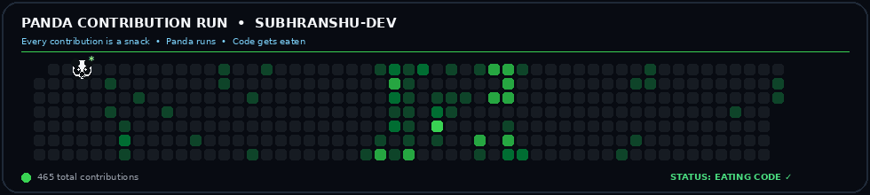

<h1 align="center">🚀 Subhranshu Nanda</h1>

<h3 align="center">
AI/ML Developer • Full-Stack Project Builder • SpaceTech Enthusiast
</h3>

⚡ Building intelligent systems that think, detect & decide

---

## 🧠 About Me

👋 Hi there, I'm **Subhranshu**

🚀 Building AI-powered Smart Intelligence Systems using Computer Vision, real-time detection, and decision-making

💻 Built multiple full-stack and API-driven projects focused on clean architecture, scalability, and real-world problem solving

🧠 Interests: AI/ML • Computer Vision • Intelligent Systems

🛰️ Exploring SpaceTech & real-world AI applications aligned with intelligent systems

🤝 Looking to collaborate on AI/ML, Computer Vision, and backend system projects

🛠️ Seeking help in scaling, deploying, and optimizing real-world AI systems

💬 Ask me about AI systems, APIs, and computer vision

⚡ Fun fact: I focus more on building real projects than just learning theory

---

## 🚀 Current Focus

* 🧠 Currently deep-driving into **Machine Learning, Computer Vision & Deep Learning**
* 🛰️ SpaceTech AI Systems
* 🛡️ Surveillance & Detection Systems
* 🤖 Autonomous Decision Systems
* ⚡ AI + Backend Integration

---

## 🧠 Learning

* DSA (Java) • Python • C
* Machine Learning • Deep Learning
* Computer Vision • Transformers
* FastAPI • System Design
* MLOps • Cloud • GPU Training

---

## 🛰️ Vision

* Satellite image processing
* Disaster detection systems
* AI-based surveillance
* Intelligent autonomous systems

---

## ⚙️ Approach

* Build real-world AI + Fullstack projects
* Hackathons & collaboration
* Focus on scalable implementations

---

## 🎯 Goal

Become an **AI Engineer (Intelligent Systems + SpaceTech)**
→ Target: Research labs & deep-tech companies

---

## 🌐 Connect With Me

---

# ⚡ SYSTEM STATUS

<code>████████████████████████████████████████ 100%</code>

<i>Turning ideas → intelligent systems → real-world impact.</i>

---

# 💻 Tech Stack

### 🧠 AI / ML / Data Science

---

### 👁️ Computer Vision & Simulation

---

### ⚙️ Backend & APIs

---

### 🎨 Frontend

---

### 🗄️ Database

---

### 🚀 Deployment & DevOps

---

### 🧪 Testing & Tools

---

### 🔧 Version Control

---

### 🎬 Creative & Design Tools

---

# 📊 GitHub Stats

---

# 📈 Contribution Graph

---

# 🐼 CONTRIBUTION PANDA

<b>🐼 Every green square is a snack.</b>  Watch the panda run through the contribution grid and eat the code. 😂

<code>PANDA STATUS: EATING CODE ✓</code>

---

# 🧊 3D CONTRIBUTION UNIVERSE

<b>Contribution history — but in another dimension.</b> 🛰️

---

# 🐍 CONTRIBUTION ARCADE

<picture>
<source media="(prefers-color-scheme: dark)"
srcset="https://raw.githubusercontent.com/subhranshu-dev/subhranshu-dev/output/github-snake-dark.svg">
<source media="(prefers-color-scheme: light)"
srcset="https://raw.githubusercontent.com/subhranshu-dev/subhranshu-dev/output/github-snake.svg">

</picture>

🐍 Classic contribution mode • 🐼 Panda mode • 🧊 3D mode

---

## 🚀 Featured Projects

### 🛰️ AgriSat – AI-Powered Satellite Intelligence System

🔹 AI-based system for **satellite image analysis & environmental monitoring**
🔹 Focus on **land-use detection, crop monitoring & smart insights**
🔹 Built using **Computer Vision + ML models for real-world impact**

🔗 Project Link: https://github.com/subhranshu-dev/agrisat

---

### 🤖 OmniAI – Intelligent Multi-System AI Platform

🔹 Integrated AI system combining **detection, automation & decision-making**
🔹 Supports **real-time processing & smart backend integration**
🔹 Designed for **scalable intelligent applications**

🔗 Project Link: https://github.com/subhranshu-dev/omniai

---

# 🛰️ MISSION CONTROL

| SYSTEM             | MISSION                          | STATUS       |
| ------------------ | -------------------------------- | ------------ |
| 🧠 AI Engine       | Machine Learning + Deep Learning | 🟢 ACTIVE    |
| 👁️ Vision Core    | Detection + Computer Vision      | 🟢 ACTIVE    |
| ⚙️ Backend Core    | APIs + Intelligent Systems       | 🟢 ACTIVE    |
| 🛰️ Space Module   | SpaceTech + Satellite AI         | 🟡 EXPLORING |
| 🤖 Autonomous Core | Decision Systems                 | 🟡 BUILDING  |

---

## ✍️ Dev Quote

---

  👁️ Visitors

---

  

  <b>🚀 Build. Detect. Decide. Explore.</b> 
  AI × Computer Vision × Backend × SpaceTech

