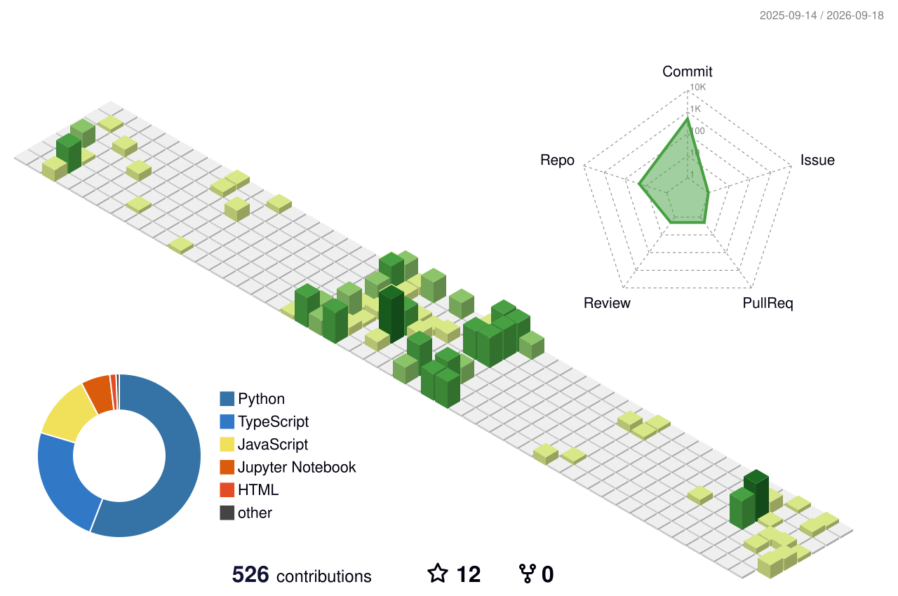

 

  

  

  

  

### `AI/ML DEVELOPER` · `COMPUTER VISION` · `FULL-STACK` · `SPACETECH`

---

# 🧠 ABOUT ME

<table>
<tr>

<td width="52%" valign="top">

### 👋 Hi, I'm Subhranshu

🚀 Building **AI-powered intelligent systems** using Machine Learning, Computer Vision, real-time detection and decision-making.

💻 Building full-stack and API-driven applications with a focus on clean architecture, scalable systems and practical problem solving.

🧠 Exploring modern AI through:

- Machine Learning
- Deep Learning
- Computer Vision
- LLMs
- Generative AI
- RAG
- MCP
- Intelligent Systems

🛰️ Interested in **SpaceTech and real-world AI applications**.

🤝 Open to collaboration on interesting **AI/ML, Computer Vision and backend projects**.

</td>

<td width="48%" valign="top">

### ⚡ WHAT I BUILD

<table>

<tr>
<td align="center">

🧠  
<b>AI SYSTEMS</b>

</td>

<td align="center">

👁️  
<b>VISION</b>

</td>
</tr>

<tr>
<td align="center">

🤖  
<b>GENAI</b>

</td>

<td align="center">

⚙️  
<b>BACKEND</b>

</td>
</tr>

<tr>
<td align="center">

🛰️  
<b>SPACETECH</b>

</td>

<td align="center">

🚀  
<b>REAL-WORLD APPS</b>

</td>
</tr>

</table>

 

`PERCEPTION` → `INTELLIGENCE` → `ACTION`

</td>

</tr>
</table>

---

# 🧬 AI SYSTEM BLUEPRINT

<table>

<tr>

<td align="center" width="20%">

### 👁️

**PERCEPTION**

Computer Vision  
Object Detection  
Image Processing

</td>

<td align="center" width="20%">

### 🗃️

**DATA**

Datasets  
Annotation  
Knowledge

</td>

<td align="center" width="20%">

### 🧠

**INTELLIGENCE**

ML  
DL  
LLMs  
GenAI

</td>

<td align="center" width="20%">

### 🔗

**REASONING**

RAG  
MCP  
AI Agents  
Decision Systems

</td>

<td align="center" width="20%">

### ⚡

**ACTION**

APIs  
Automation  
Deployment  
Real-Time Systems

</td>

</tr>

</table>

 

&nbsp;→&nbsp;

&nbsp;→&nbsp;

&nbsp;→&nbsp;

&nbsp;→&nbsp;

---

# 📚 CURRENT LEARNING

<table>

<tr>

<td width="50%" valign="top">

### 🤖 MODERN AI

- Large Language Models — **LLMs**
- Generative AI
- Prompt Engineering
- AI Agents
- Retrieval-Augmented Generation — **RAG**
- Embeddings
- Semantic Search
- Model Integration

</td>

<td width="50%" valign="top">

### 🔌 AI INFRASTRUCTURE

- Model Context Protocol — **MCP**
- AI APIs
- Knowledge Systems
- Vector Search
- Agentic Workflows
- AI + Backend Integration
- Production AI Systems

</td>

</tr>

</table>

 

### 💻 CORE

`DSA (Java)` · `Python` · `C` · `FastAPI` · `System Design`

### 👁️ VISION

`Computer Vision` · `Transformers` · `Object Detection` · `Real-Time Vision`

### ☁️ PRODUCTION

`MLOps` · `Cloud` · `GPU Training` · `Model Deployment`

---

# 👁️ COMPUTER VISION & DATA LAB

<table>

<tr>

<td align="center" width="33%">

### 🏷️ DATA ANNOTATION

  

  

Image Annotation  
Object Detection  
Segmentation  
Dataset Preparation

</td>

<td align="center" width="33%">

### 👁️ COMPUTER VISION

  

  

  

Detection · Tracking · Image Processing

</td>

<td align="center" width="33%">

### 🧪 DATA PIPELINE

`COLLECT`

↓

`ANNOTATE`

↓

`CLEAN`

↓

`TRAIN`

↓

`EVALUATE`

↓

`DEPLOY`

</td>

</tr>

</table>

---

# 💻 TECHNOLOGY MATRIX

<table>

<tr>

<td width="50%" valign="top">

## 🧠 AI / ML / DATA

 

</td>

<td width="50%" valign="top">

## ✨ LLM / GENAI

 

  

`LLMs` · `RAG` · `GenAI` · `MCP` · `AI Agents` · `Embeddings`

</td>

</tr>

<tr>

<td width="50%" valign="top">

## 👁️ COMPUTER VISION

  

`Detection` · `Tracking` · `Segmentation` · `Image Processing`

</td>

<td width="50%" valign="top">

## 🏷️ DATA ANNOTATION

  

`Dataset Preparation` · `Annotation` · `Segmentation`

</td>

</tr>

<tr>

<td width="50%" valign="top">

## ⚙️ BACKEND & APIs

 

 

</td>

<td width="50%" valign="top">

## 🎨 FRONTEND

  

`Responsive UI` · `API Integration` · `Modern Web Apps`

</td>

</tr>

<tr>

<td width="50%" valign="top">

## 🗄️ DATABASE

</td>

<td width="50%" valign="top">

## 🚀 DEPLOYMENT & DEVOPS

 

</td>

</tr>

<tr>

<td width="50%" valign="top">

## 🧪 TESTING & TOOLS

</td>

<td width="50%" valign="top">

## 🔧 VERSION CONTROL

</td>

</tr>

<tr>

<td colspan="2" align="center">

## 🎬 CREATIVE & DESIGN

</td>

</tr>

</table>

---

# 📊 GITHUB TELEMETRY

<table>

<tr>

<td width="50%" align="center">

</td>

<td width="50%" align="center">

</td>

</tr>

</table>

 

<table>

<tr>

<td align="center">

</td>

<td align="center">

</td>

<td align="center">

</td>

<td align="center">

</td>

</tr>

</table>

---

# 🛸 GALAGA CONTRIBUTION ARCADE

  

---

# 🧊 3D CONTRIBUTION UNIVERSE

  

---

# 🚀 FEATURED PROJECTS

<table>

<tr>

<td width="50%" valign="top">

<a href="https://github.com/subhranshu-dev/AgriSat">

## 🌾 AgriSat

### AI-Powered Satellite Intelligence System

AI-powered precision agriculture platform leveraging satellite imagery, crop-health analytics, disease detection, weather intelligence and smart farming insights.

`Computer Vision` · `Machine Learning` · `Satellite Intelligence`

 

</a>

</td>

<td width="50%" valign="top">

<a href="https://github.com/subhranshu-dev/OmniSense_AI">

## 🛰️ OmniSenseAI

### Intelligent Space & Surveillance AI Platform

AI-powered surveillance and space-intelligence platform combining real-time computer vision, celestial tracking, threat analytics and interactive geospatial visualization.

`Computer Vision` · `AI` · `SpaceTech` · `Real-Time Systems`

 

</a>

</td>

</tr>

<tr>

<td width="50%" valign="top">

<a href="https://github.com/subhranshu-dev/MockForgeAI">

## 🎯 MockForgeAI

### AI-Powered Interview Intelligence

AI-driven interview preparation and assessment platform focused on intelligent questioning, candidate interaction and performance analysis.

 

</a>

</td>

<td width="50%" valign="top">

<a href="https://github.com/subhranshu-dev/StoryNebula">

## ✨ StoryNebula

### Generative AI Storytelling

Creative AI system exploring generative storytelling, intelligent narrative generation and immersive digital experiences.

 

</a>

</td>

</tr>

<tr>

<td width="50%" valign="top">

<a href="https://github.com/subhranshu-dev/LunaVis-App">

## 🌙 LunaVis

### Astronomy Visualization

Interactive astronomy application focused on lunar information, celestial visualization and SpaceTech exploration.

 

</a>

</td>

<td width="50%" valign="top">

<a href="https://github.com/subhranshu-dev/AeroLink--Vision-Based-Drone-Landing-System">

## 🚁 AeroLink

### Vision-Based Drone Landing

Computer-vision-based autonomous drone landing research using marker detection, positioning and intelligent visual navigation.

 

</a>

</td>

</tr>

</table>

---

# 💡 INTELLIGENT SYSTEM FLOW

<table>

<tr>

<td align="center">

### 01

👁️

**PERCEIVE**

Vision  
Text  
Data

</td>

<td align="center">

### 02

🗃️

**PREPARE**

Collect  
Annotate  
Clean

</td>

<td align="center">

### 03

🧠

**LEARN**

ML  
DL  
LLMs

</td>

<td align="center">

### 04

🔗

**REASON**

RAG  
MCP  
Agents

</td>

<td align="center">

### 05

⚡

**ACT**

API  
Automation  
Deployment

</td>

</tr>

</table>

 

&nbsp;→&nbsp;

&nbsp;→&nbsp;

&nbsp;→&nbsp;

---

# 💻 LIVE TECH QUOTE

 

 

⚡ Dynamically generated programming quote · refreshes automatically

---

# 🌐 CONNECT WITH ME

 

  

---

### `AI` × `VISION` × `GENAI` × `BACKEND` × `SPACETECH`

 

Building intelligent systems, one experiment at a time.

